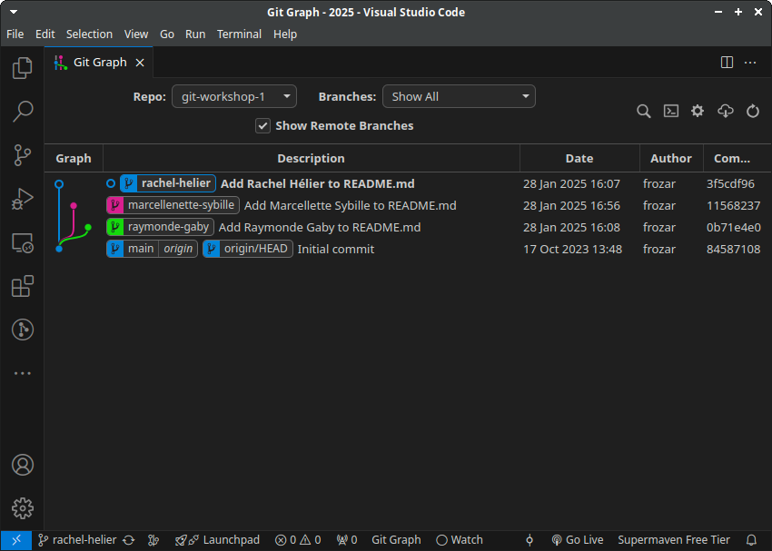
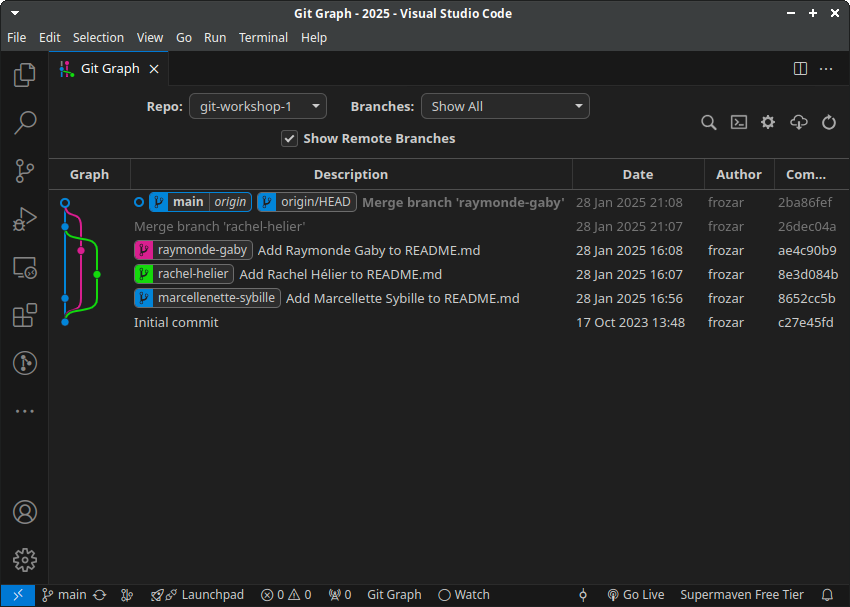
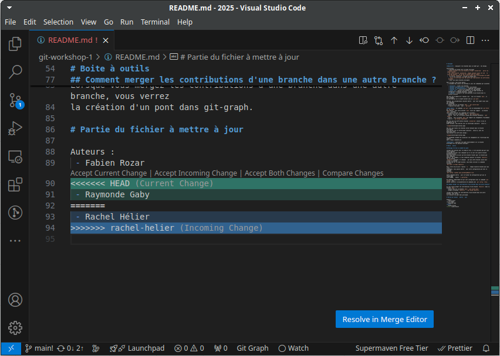
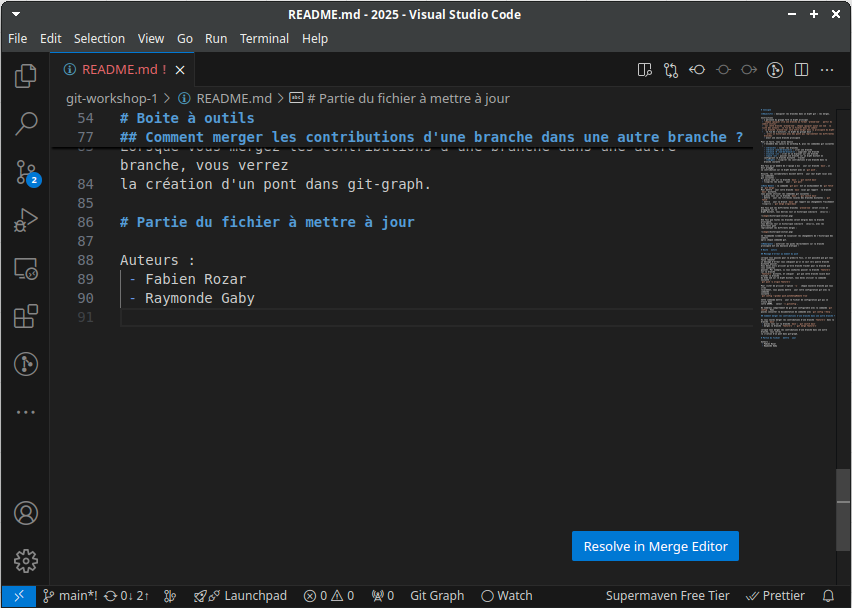
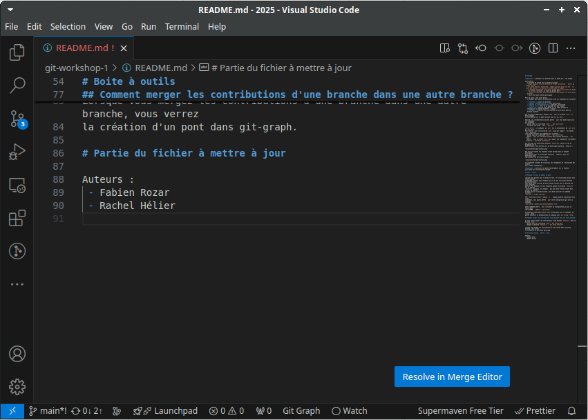
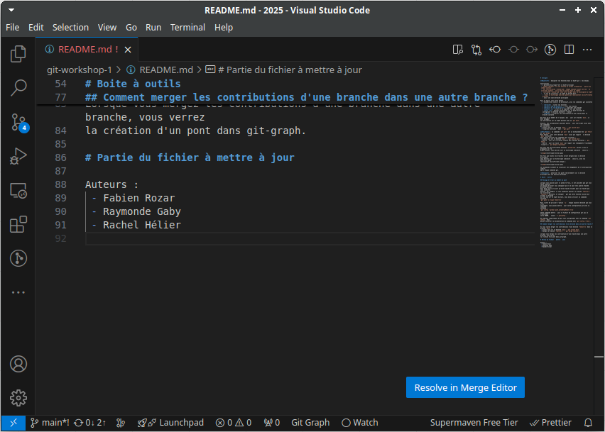

# Consigne

**Objectif** : modifier la branche principale de votre dépôt à l'aide de branches et de merges.

Instructions
 - 1 personne du groupe fork ce dépôt principal
 - la personne qui crée le fork doit ajouter ces collègues comme collaborateur du dépôt
 - les collaborateurs récupèrent le dépôt forké
 - chaque collaborateur crée une branche au format `prenom-nom` à partir du commit initial
 - à partir de sa branche `prenom-nom`, chaque collaborateur va ajouter son prénom/nom à la liste des auteurs dans le fichier `authors.txt` dans un commit
 - à tour de rôle :
   1. 1 collaborateur va merger sa branche `prenom-nom` avec la branche `main` local et propager sa branche `main` sur le dépôt distant
   2. les collaborateurs qui n'ont pas fait la propagation doivent mettre à jour leur branche `main` locale avant de faire leur merge, reprendre l'étape 'i.'
 - à la fin de l'activité, le dépôt du groupe devrait avoir :
   - un historique de commits avec des ponts qui représentent les différents merges
   - une la branche principale et les branches de développement

Pour se faire, vous aurez besoin de l'ensemble des savoirs du workshop 0, plus les commandes git suivantes :
 - **branch** : lister les branches locales
 - **branch \<nom-de-branche\>** : créer une branche
 - **branch -D \<nom-de-branche\>** : supprimer une branche
 - **switch \<nom-de-branche\>** : se déplacer sur une branche
 - **switch -c \<nom-de-branche\>** : créer et se déplacer sur une branche
 - **push** : propager les contributions d'une branche sur un dépôt distant
 - **merge** : récupérer les contributions d'une branche dans la branche courante

Lisez les sections de la "Boite à outils" pour réaliser cet exercice.

## Dans l'historique de commits

Une fois que les différentes branches `prenom-nom` seront créées, vous devriez voir 
un historique similaire à celui-ci :

Une fois que toutes les branches seront mergées dans la branche principale, 
vous devriez voir un histoirique similaire à celui-ci, avec les différents ponts
représentants les différents merges :

Généralement, suite au merge d'une branche de développement dans la branche main,
vous n'avez plus besoin de cette branche locale. Je conseille de supprimer les 
branches qui ne sont plus utiles après un merge.

Visualisez les changements de l'historique des commits après chaque commande git.

## Bilan

Vous savez maintenant travailler à plusieurs sur un dépôt GitHub et utiliser des 
merges avec des branches locales pour intégrer vos contributions à la branche 
principale.

**Remarque 1** : Lorsque que vous mergez une branche sur la branche principale locale,
vous n'avez plus besoin de la branche mergé. Vous pouvez supprimer des branches 
locales avec la commande `git branch -d <nom-de-branche>`.

**Remarque 2** : Cette méthode ne vous permet pas de faire de revu de code. Avant
de faire le merge, vous ne visualisez pas les changements qui ont été faits dans
la branche distante. Vous voyez uniquement les changements qui provoquent des conflits.

**Remarque 3** : Pour pouvoir appliquer cette méthode, vous devez avoir les droits
de pousser sur la branche principale. La branche principale est la version stable 
de votre projet, elle devrait donc être protégée. Une branche protégée interdit
de pousser des modifications sur elle directement. Pour modifier une branche protégée,
vous devez faire des Pull Requests sur GitHub.

# Boite à outils

## Message d'erreur au moment du push

Lorsque vous poussez pour la première fois, il est possible que git vous fasse remonter 
un message d'erreur vous indiquant qu'il ne sait vers quelle branche distante pousser.
Vous devez alors préciser qu'elle branche tracker pour la branche que vous souhaitez
pousser. Par exemple, si vous souhaitez pousser la branche `feature-1` sur la branche
`feature-1` distante, et indiquer à git que cette branche locale doit tracker la branche
du même nom sur le dépôt distant, vous devez utiliser la commande suivante :
`git push -u origin feature-1`

Pour éviter de préciser l'option `-u` à chaque nouvelle branche que vous créez 
localement, vous pouvez mettre à jour votre configuration git avec la commande
suivante :
`git config --global push.autoSetupRemote true`

Cette commande mettra à jour le fichier de configuration git qui se trouve dans
votre $HOME, à savoir `~/.gitconfig`.

De nombreux comportement de git sont configurable avec la commande `git config`. Vous 
pouvez consulter la documentation de commande avec `git config --help`.

## Comment merger les contributions d'une branche dans une autre branche ?

Si vous voulez merger les contributions d'une branche `feature-1` dans la branche `main` :
 - placez vous sur la branche `main`: `git switch main`
 - mergez la branche `feature-1` : `git merge feature-1`

Lorsque vous mergez les contributions d'une branche dans une autre branche, vous verrez
la création d'un pont dans git-graph.

## La résolution de conflit

Lorsque vous faites un merge avec git, vous pouvez avoir des conflits qui apparaîssent.
Cela se produit lorsque git tente de fusionner les contributions issue d'une branche
est qu'il remarque qu'il y a eu plusieurs modifications sur une même ligne et que sa
stratégie de résolution a échoué. Dans ce cas, git vous invite à résoudre le conflit
manuellement.

Lorsque vous avez un conflit, utilisez `git status` pour savoir quels sont les fichiers
qui sont marqué comme "both modified". Les fichiers dans cet état ont été annotés
avec les lignes suivantes :
 - `<<<<<<< HEAD`
 - `=======`
 - `>>>>>>> <nom-de-branche>`

Les sections du fichier entre les lignes `<<<<<<< HEAD` et `=======` correspondent aux
lignes issue des modifications de la branche courante, sur laquelle vous êtes.

Les sections du fichier entre les lignes `=======` et `>>>>>>> <nom-de-branche>` 
correspondent aux lignes qui ont aussi été modifié par la branche qui vous essayez 
de merger, d'intégrer.

Si vous ouvrez un fichier en clonflit avec VSCode, vous verrez quelque chose de 
similaire à cette image :  

Pour résoudre un conflit, vous avez 3 options :
 - `Accept Current Change` : accepter uniquement les modifications de la branche sur laquelle vous êtes
 - `Accept Incoming Change` : accepter uniquement les modifications de la branche avec laquelle vous essayez de merger
 - `Accept Both Changes` : accepter les deux modifications pour pouvoir éventuellement les éditer manuellement

Si vous cliquez sur l'option `Accept Current Change`, il ne restera que les lignes de
la section verte :

Si vous cliquez sur l'option `Accept Incoming Change`, il ne restera que les lignes de
la section bleue :

Si vous cliquez sur l'option `Accept Both Changes`, les lignes issues issues des 2 
blocs, vert et bleu, resteront dans le fichier :

Une fois que vous avez choisi une option, et potentiellement modifié le fichier, pour
retrouver un état stable, **n'oubliez pas d'enregistrer vos modifications**.

Pour indiquer à git que vous avez résolu le conflit, suivez les indications proposées
par `git status`.

Il proposera certainement d'ajouter au `Stage` les fichiers pour lesquels vous avez
résolut des conflits : `git add <nom-de-fichier>`

Ensuite, utilisez la commande `git commit` pour finaliser le merge :
`git commit`